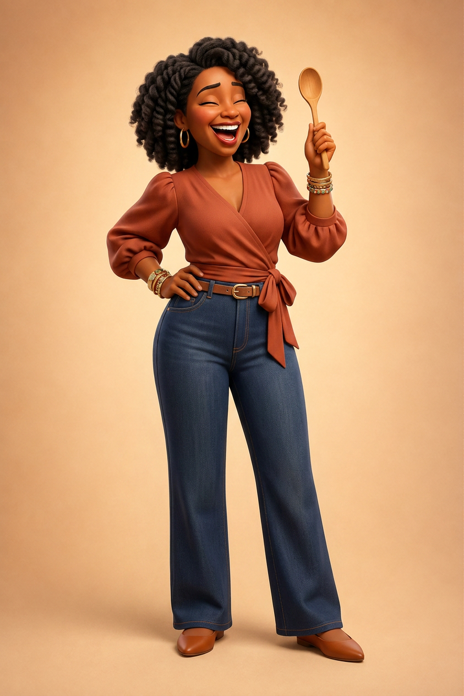
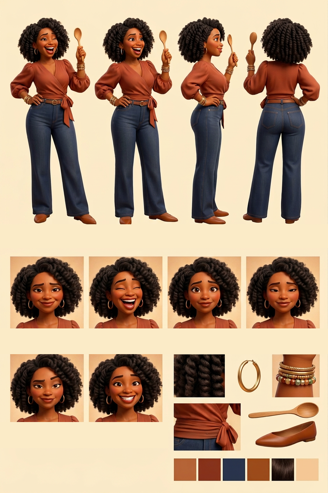

# Brenda Washington — Visual Library

> **Status:** Natural-hair fashionista hero approved August 18, 2026; full reference sheet pending

## Upload new candidates

Drop original, highest-resolution images into **`00-upload-candidates/`** on GitHub. Images from ChatGPT or another generator may be used as candidates when Keisha generated them or otherwise has the right to use them. Avoid third-party character art that is not ours.

Recommended filename: `source-YYYY-MM-DD-short-description.png`

After uploading, tell the Workhorse which character you updated. No upload becomes the approved face automatically; Keisha chooses the winner at a focused visual gate.

## Approved art

**[hero-brenda.png](02-approved/hero-brenda.png)** — controlling visual identity

## Signature locks

- Must read as a youthful mom in her late 30s
- Polished voluminous shoulder-length natural twist-out with soft defined curls
- Terracotta wrap blouse, tailored dark-indigo wide-leg jeans, cognac belt and pointed flats
- Gold hoops and stacked bracelets
- Wooden spoon as her recurring family-call prop

## Candidates

_None currently awaiting review._

## Approved reference board

**[approved-brenda-model-board-v04.png](03-reference-sheets/approved-brenda-model-board-v04.png)**

This clean board locks four views, six expressions, isolated props, and palette without callout arrows or captions.

## Scenes

_New scenes must use the approved hero and future reference sheet._

## Superseded—do not use as current reference

- [Previous Arena kitchen hero](99-superseded/hero-brenda-arena-previous.png)
- [Uploaded headwrap candidate](99-superseded/hero-brenda-chatgpt-headwrap-v01.png)
- [Retired Maritza-era art](99-superseded/maritza-mom-retired-canon.png)

## Approval rule

The approved hero supplies Brenda's exact face, natural hair, age-read, proportions, and signature wardrobe. If a future image drifts, reject the image—not Brenda.
