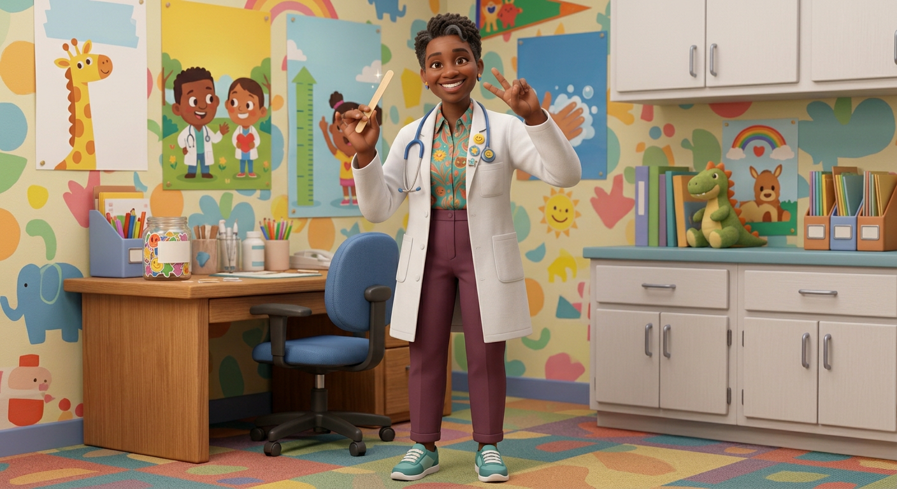

# Dr. Smiles — Visual Library

> **Status:** Gender recast approved—Dr. Smiles is a Black woman; exact woman hero candidate awaiting approval

## Current woman candidate

**[arena-2026-08-18-hero-dr-smiles-woman-v02.png](00-upload-candidates/arena-2026-08-18-hero-dr-smiles-woman-v02.png)**

## Canon already locked

- Dr. Smiles is an African American Black woman pediatrician in her early-to-mid 40s
- Warm, playful, patient, and medically responsible
- Exact hair, face, outfit, and hero details await Keisha's visual approval

## Superseded—do not use as current reference

- [Retired male Dr. Smiles](99-superseded/dr-smiles-male-retired-canon.png)

## Approval rule

The retired male art cannot be reused. The woman candidate remains proposed until Keisha explicitly approves her exact identity.
