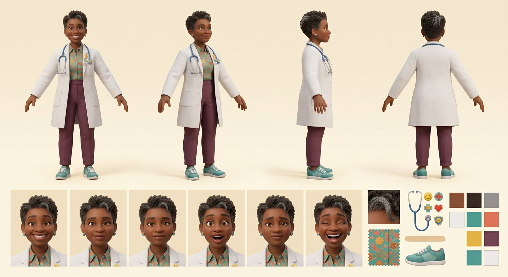

# Dr. Smiles — Visual Library

> **Status:** Reference board approved August 18, 2026; Woman Dr. Smiles hero approved August 18, 2026; retired male identity blocked

## Approved art

**[hero-dr-smiles.png](02-approved/hero-dr-smiles.png)** — controlling visual identity

## Signature locks

- African American Black woman pediatrician in her early-to-mid 40s
- Rich medium-deep brown skin, kind crinkly eyes, round joyful face, genuine grin
- Short natural tapered curls with silver-gray accent
- White doctor's coat, teal-coral-gold patterned blouse, plum ankle trousers
- Teal-white sneakers, stethoscope, cheerful icon pins
- Tongue depressor used like a magic wand and playful peace-sign pose

## Approved reference board

**[approved-dr-smiles-model-board-v02.png](03-reference-sheets/approved-dr-smiles-model-board-v02.png)**

This board locks four views, six expressions, isolated props, and palette without annotation arrows or callout text.

## Superseded—do not use as current reference

- [Retired male Dr. Smiles](99-superseded/dr-smiles-male-retired-canon.png)

## Approval rule

The approved hero supplies Dr. Smiles's exact woman identity, age-read, hair, face, proportions, and wardrobe. Male art and pronouns cannot return. If a future image drifts, reject the image—not Dr. Smiles.
