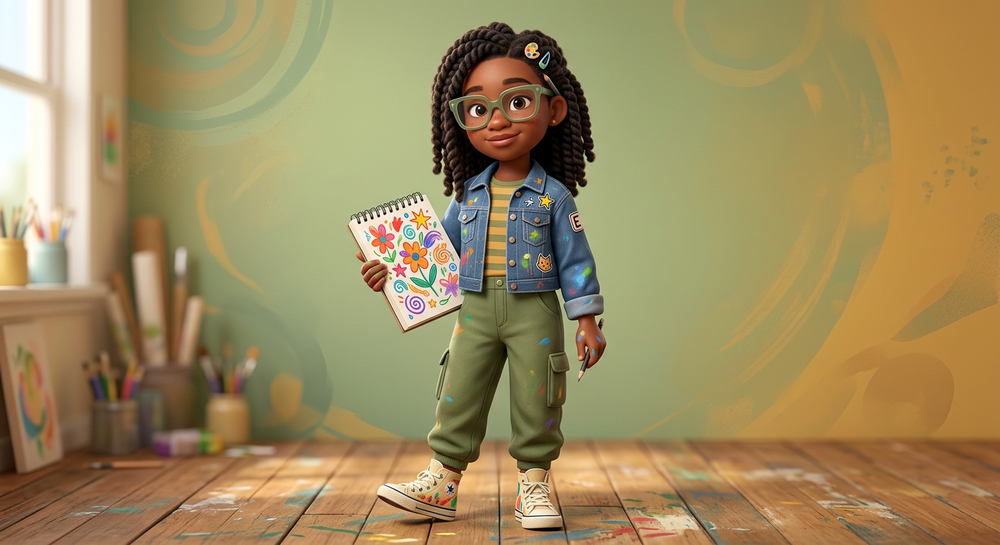
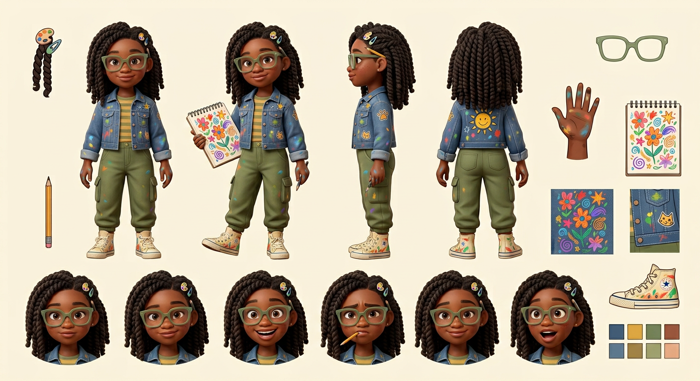

# Emma — Visual Library

> **Status:** Earthy artist redesign approved August 18, 2026; full reference sheet pending

## Approved art

**[hero-emma.png](02-approved/hero-emma.png)** — controlling visual identity

## Signature locks

- 10-year-old thoughtful Black artist with medium-deep warm-brown skin and light freckles
- Shoulder-length chunky two-strand twists styled half-up with artist-palette/paint-drop clips
- Oversized translucent sage square glasses and pencil behind ear
- Paint-splattered doodle-patch denim chore jacket, mustard/sage striped tee
- Olive cargo pants, cream painted high-top canvas sneakers
- Paint-marked fingers, pencil, open colorful sketchbook
- Calm observant expression like she noticed the clue everyone missed

## Reference sheets

_New turnaround, expression row, twists/clips/glasses callouts, wardrobe palette, sketchbook, art tools, and observant poses will be built from the approved hero._

## Approved reference board

**[approved-emma-model-board-v02.png](03-reference-sheets/approved-emma-model-board-v02.png)**

This clean board locks four views, six expressions, isolated props, and palette without callout arrows or captions.

## Superseded—do not use as current reference

- [Previous similar Emma/Sophie design](99-superseded/emma-previous-similar-design.png)

## Approval rule

The approved hero supplies Emma's exact face, age-read, hair, glasses, proportions, wardrobe, palette, and artist props. If a future image drifts, reject the image—not Emma.
