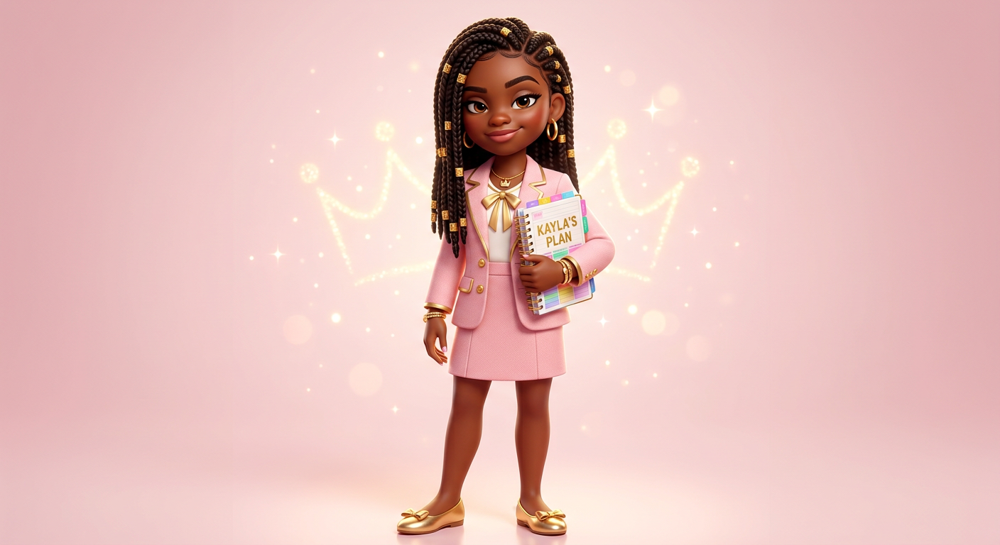
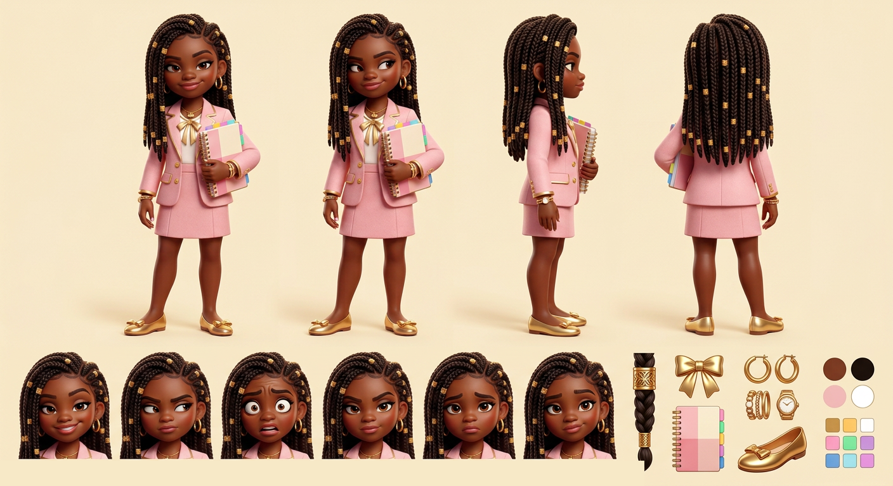

# Kayla — Visual Library

> **Status:** Reference board approved August 18, 2026; Approved as uploaded August 18, 2026; reference sheet pending

## Approved art

**[hero-kayla.png](02-approved/hero-kayla.png)** — controlling visual identity

## Signature locks

- 10-year-old polished queen-bee rival
- Long side-parted box braids with gold cuffs; gold hoops and accessories
- Soft-pink tailored blazer/skirt, white blouse with large gold bow, gold ballet flats
- Color-tabbed `KAYLA’S PLAN` planner and poised competitive smile

## Approved reference board

**[approved-kayla-model-board-v05.png](03-reference-sheets/approved-kayla-model-board-v05.png)**

This board locks four views, six expressions, isolated props, and palette without annotation arrows or callout text.

## Approval rule

The approved hero supplies Kayla’s exact identity. If a future image drifts or reintroduces technical errors, reject the image—not the character.
