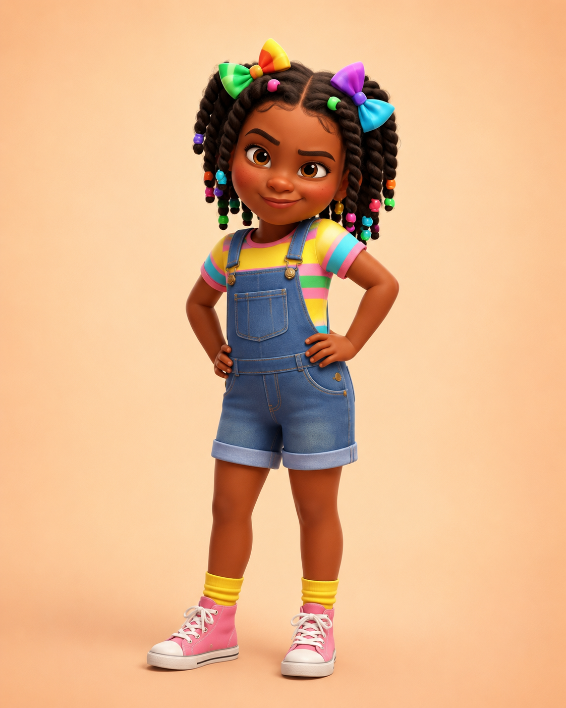
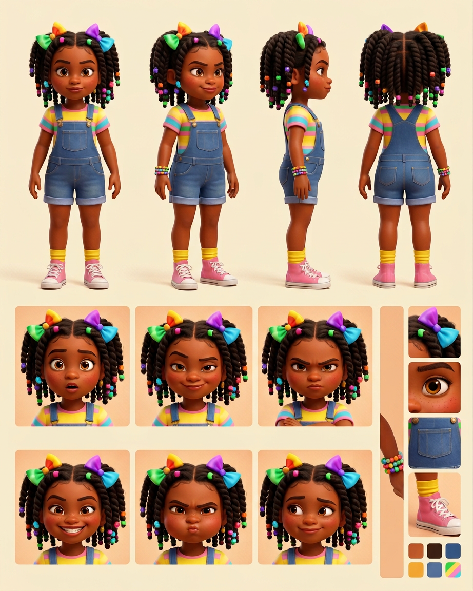

# Lily Washington — Visual Library

> **Status:** Uploaded ChatGPT hero approved exactly August 18, 2026; full reference sheet pending

## Approved art

**[hero-lily.png](02-approved/hero-lily.png)** — controlling visual identity

## Signature locks

- 8-year-old younger sister with warm brown skin, rosy freckled cheeks, huge amber-brown eyes
- Shoulder-length twists/braids with colorful beads and oversized mismatched bows
- Rainbow-striped tee, denim shortalls, yellow socks, pink high-tops
- Confident hands-on-hips mischievous pose
- Her habit of collecting "borrowed" items remains a story trait even when her pockets look empty

## Reference sheets

_New turnaround, expression row, bow/bead map, outfit palette, and borrowed-item comedy poses will be built from the approved hero._

## Approved reference board

**[approved-lily-model-board-v03.png](03-reference-sheets/approved-lily-model-board-v03.png)**

This clean board locks four views, six expressions, isolated props, and palette without callout arrows or captions.

## Superseded—do not use as current reference

- [Previous Arena hero](99-superseded/hero-lily-arena-previous.png)
- [Early Lily candidate](99-superseded/lily-early-candidate.png)

## Approval rule

The approved hero supplies Lily's exact face, age-read, hair, bows/beads, proportions, and signature outfit. If a future image drifts, reject the image—not Lily.
