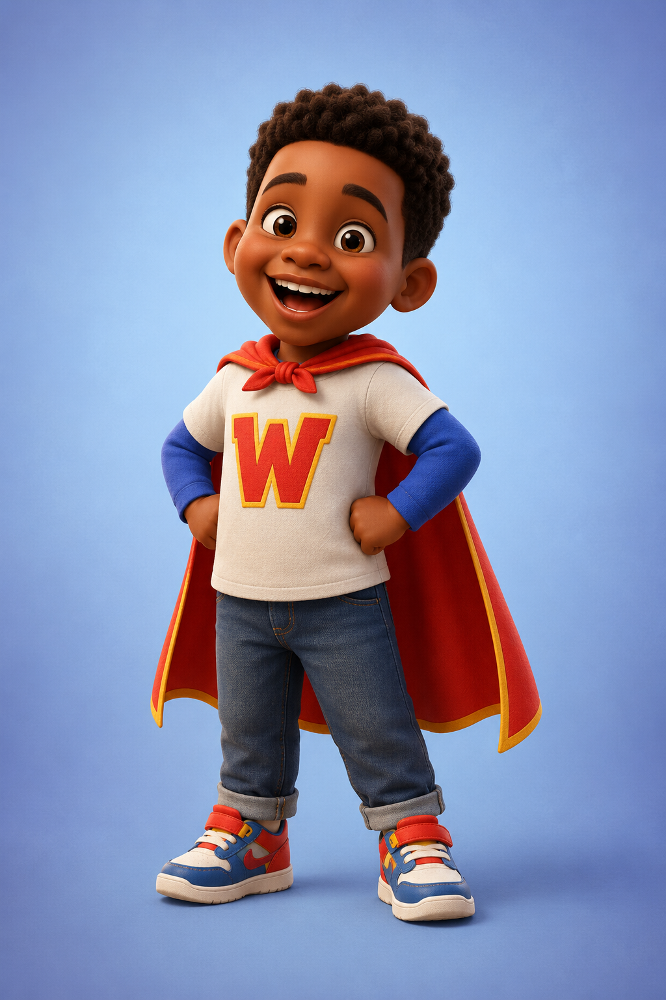
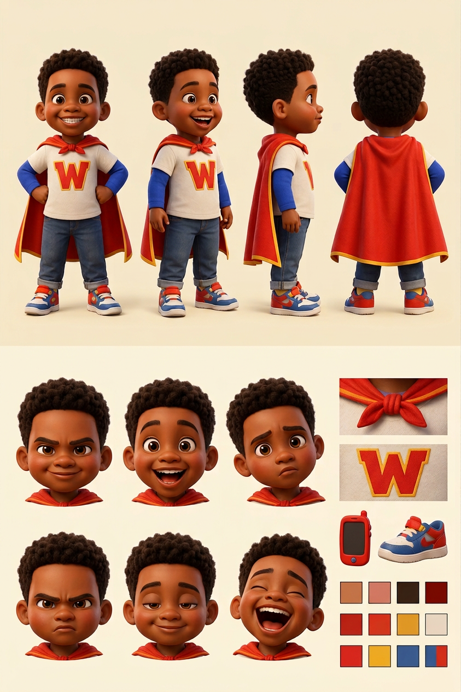

# Max Washington — Visual Library

> **Status:** Uploaded ChatGPT hero approved exactly August 18, 2026; full reference sheet pending

## Approved art

**[hero-max.png](02-approved/hero-max.png)** — controlling visual identity

## Signature locks

- 5-year-old baby brother with warm brown skin, chubby cheeks, huge dark eyes, short tight curls
- Red cape with gold trim
- Cream `W` shirt over royal-blue long sleeves
- Cuffed jeans and red-blue-white sneakers
- Proud hands-on-hips superhero stance
- His love of filming Mia remains a story trait, but the toy phone is not required in every image

## Reference sheets

_New turnaround, expression row, superhero outfit palette, cape details, and filming poses will be built from the approved hero._

## Approved reference board

**[approved-max-model-board-v02.png](03-reference-sheets/approved-max-model-board-v02.png)**

This clean board locks four views, six expressions, isolated props, and palette without callout arrows or captions.

## Superseded—do not use as current reference

- [Previous Arena hero](99-superseded/hero-max-arena-previous.png)
- [Early Max candidate](99-superseded/max-early-candidate.png)

## Approval rule

The approved hero supplies Max's exact face, age-read, hair, proportions, cape, and signature outfit. If a future image drifts, reject the image—not Max.
