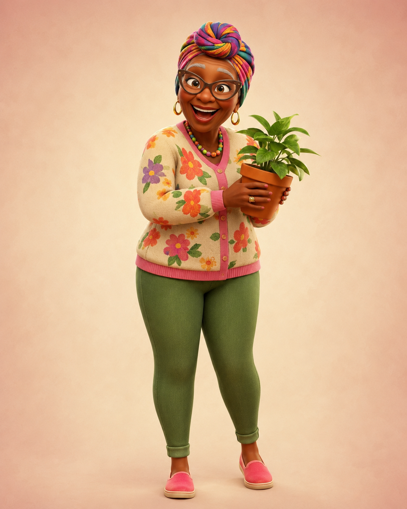
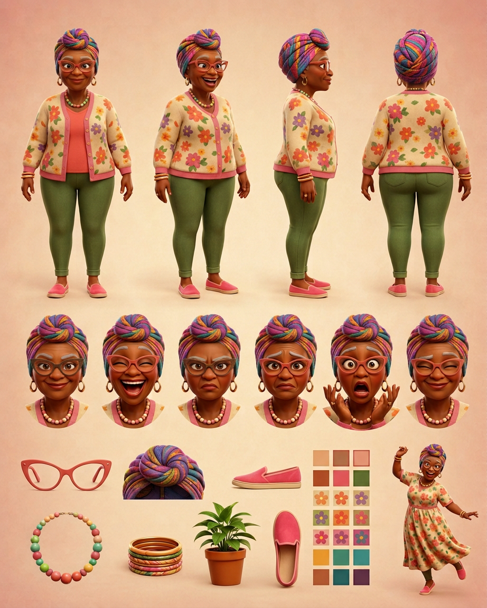

# Mema Hazel — Visual Library

> **Status:** Uploaded ChatGPT hero approved August 18, 2026; floral house dress preserved as alternate; full reference sheet pending

## Upload new candidates

Drop original, highest-resolution images into **`00-upload-candidates/`** on GitHub. Images from ChatGPT or another generator may be used as candidates when Keisha generated them or otherwise has the right to use them. Avoid third-party character art that is not ours.

Recommended filename: `source-YYYY-MM-DD-short-description.png`

After uploading, tell the Workhorse which character you updated. No upload becomes the approved face automatically; Keisha chooses the winner at a focused visual gate.

## Approved art

**[hero-mema-hazel.png](02-approved/hero-mema-hazel.png)** — controlling visual identity and hero outfit

## Signature locks

- Clearly in her 70s with warm deep-brown skin and expressive laugh lines
- Teal-patterned headwrap and oversized coral-pink cat-eye glasses worn on her face
- Flower earrings, chunky pink-and-cream beads, colorful bangles
- Floral cardigan with bold pink trim, coral top, olive pants, bright pink slip-ons
- Potted plant as recurring prop
- Approved alternate: flowing floral house dress and mid-dance show-tune pose

## Candidates

_None currently awaiting review._

## Reference sheets

_New turnaround, expression row, wardrobe palette, dance poses, glasses/headwrap details, and plant callout will be built from the approved hero._

## Scenes

_New scenes must use the approved hero and future reference sheet._

## Approved reference board

**[approved-mema-model-board-v02.png](03-reference-sheets/approved-mema-model-board-v02.png)**

This clean board locks four views, six expressions, isolated props, and palette without callout arrows or captions.

## Superseded—do not use as current reference

- [Previous Arena hero](99-superseded/hero-mema-hazel-arena-previous.png)
- [Early Mema candidate](99-superseded/mema-hazel-early-candidate.png)

## Approval rule

The approved hero supplies Mema Hazel's exact face, age-read, glasses, headwrap, proportions, and hero outfit. Her floral house dress remains an approved alternate. If a future image drifts, reject the image—not Mema.
