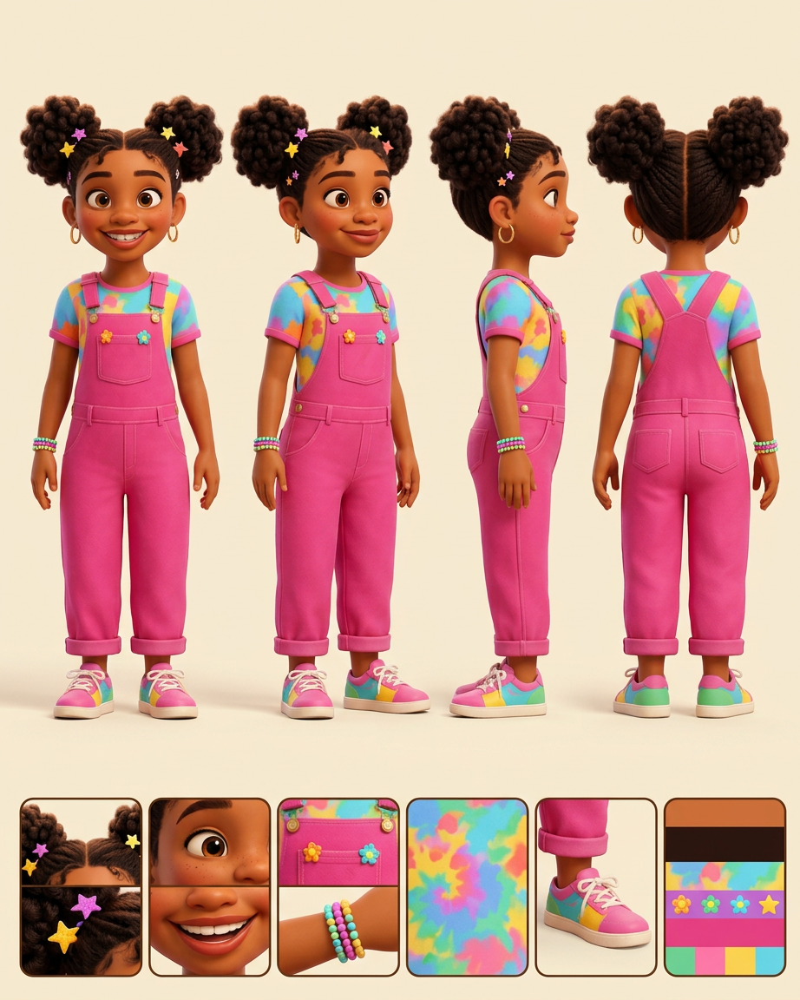
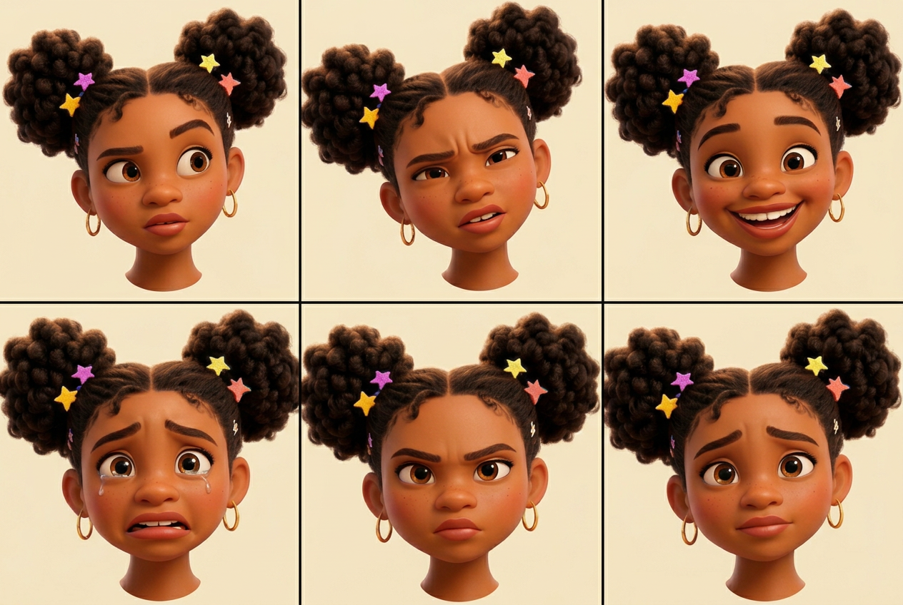
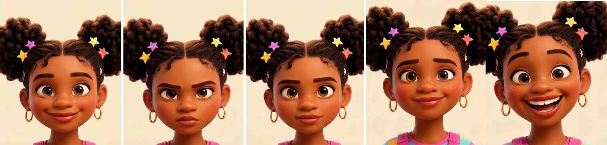

# Mia Zora Washington — Visual Library

> **Status:** Uploaded ChatGPT hero approved August 18, 2026; new full reference sheet pending

## Upload new candidates

Drop original, highest-resolution images into **`00-upload-candidates/`** on GitHub. Images from ChatGPT or another generator may be used as candidates when Keisha generated them or otherwise has the right to use them. Avoid third-party character art that is not ours.

Recommended filename: `source-YYYY-MM-DD-short-description.png`

After uploading, tell the Workhorse which character you updated. No upload becomes the approved face automatically; Keisha chooses the winner at a focused visual gate.

## Approved art

**[hero-mia.png](02-approved/hero-mia.png)** — controlling visual identity

## Candidates

_None currently awaiting review._

## Approved reference package

- [Production Reference Lock](03-reference-sheets/MIA-REFERENCE-LOCK.md)
- [Turnaround and palette v02](03-reference-sheets/approved-mia-turnaround-palette-v02.png)
- [Expressions A—first six](03-reference-sheets/approved-mia-expressions-a-v03.png)
- [Expressions B—remaining five](03-reference-sheets/approved-mia-expressions-b-v04.png)

Mia's turnaround, palette, all 11 expressions, immutable traits, and recurring detective props are now locked.

## Scenes

_New scenes must use the approved hero and future reference sheet._

## Superseded—do not use as current reference

- [Previous Arena hero](99-superseded/hero-mia-arena-previous.png)
- [Previous character sheet](99-superseded/mia-v2-character-sheet-previous-identity.png)
- [Previous Sisterwatch scene](99-superseded/mia-v2-sisterwatch-scene-previous-identity.png)

## Approval rule

The approved hero supplies Mia's exact face, hair, age-read, proportions, and signature hero outfit. **Mia has even front teeth and no gap.** Her approved expression sheet and later completed reference assets lock expressions, palette, and recurring props. If a future image adds a gap or otherwise drifts, reject the image—not Mia.
