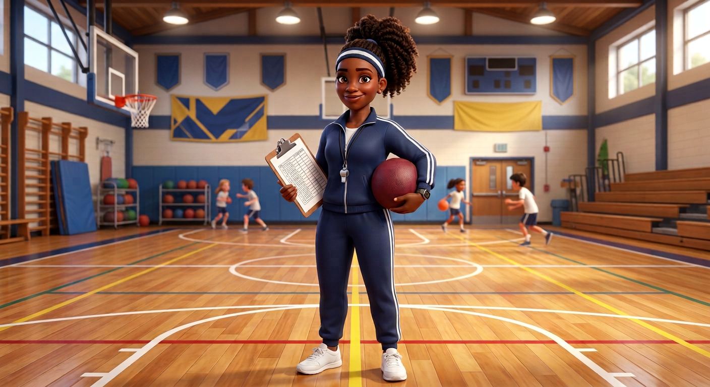
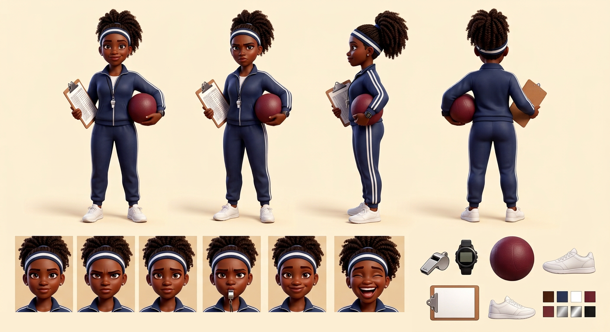

# Ms. Armstrong — Visual Library

> **Status:** Reference board approved August 18, 2026; Approved identity; school-brand-free hero produced August 18, 2026

## Approved art

**[hero-ms-armstrong.png](02-approved/hero-ms-armstrong.png)** — controlling visual identity

## Signature locks

- Tough-but-kind Black gym teacher in her 30s with athletic build
- High curly ponytail and navy-white headband
- Navy striped tracksuit, whistle, watch, clean white sneakers
- Clipboard and maroon dodgeball; generic gym with no school branding

## Approved reference board

**[approved-ms-armstrong-model-board-v03.png](03-reference-sheets/approved-ms-armstrong-model-board-v03.png)**

This board locks four views, six expressions, isolated props, and palette without annotation arrows or callout text.

## Superseded—do not use as current reference

- [ms-armstrong-branded-gym-original.png](99-superseded/ms-armstrong-branded-gym-original.png)

## Approval rule

The approved hero supplies Ms. Armstrong’s exact identity. If a future image drifts or reintroduces technical errors, reject the image—not the character.
