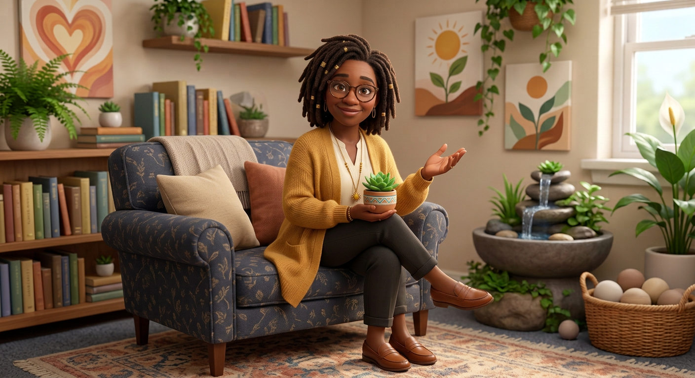
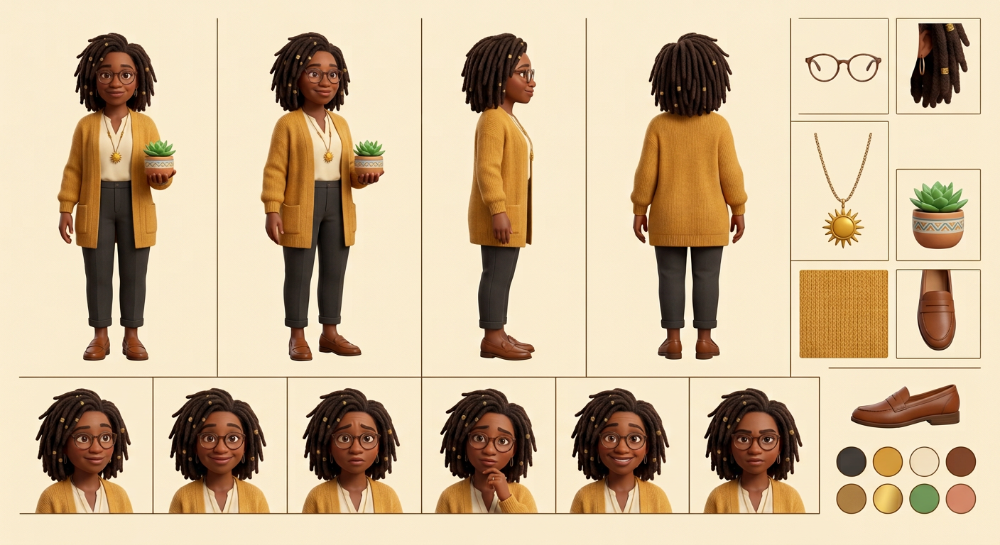

# Ms. Harmony — Visual Library

> **Status:** Reference board approved August 18, 2026; Approved identity; clean full-body hero produced August 18, 2026

## Approved art

**[hero-ms-harmony.png](02-approved/hero-ms-harmony.png)** — controlling visual identity

## Signature locks

- Wise serene Black school counselor in her 40s
- Shoulder-length locs with gold cuffs; rounded glasses
- Mustard cardigan, cream blouse, dark ankle trousers, sun pendant, brown loafers
- Succulent, open listening gesture, calm plant-filled office

## Approved reference board

**[approved-ms-harmony-model-board-v02.png](03-reference-sheets/approved-ms-harmony-model-board-v02.png)**

This board locks four views, six expressions, isolated props, and palette without annotation arrows or callout text.

## Superseded—do not use as current reference

- [ms-harmony-original.png](99-superseded/ms-harmony-original.png)

## Approval rule

The approved hero supplies Ms. Harmony’s exact identity. If a future image drifts or reintroduces technical errors, reject the image—not the character.
