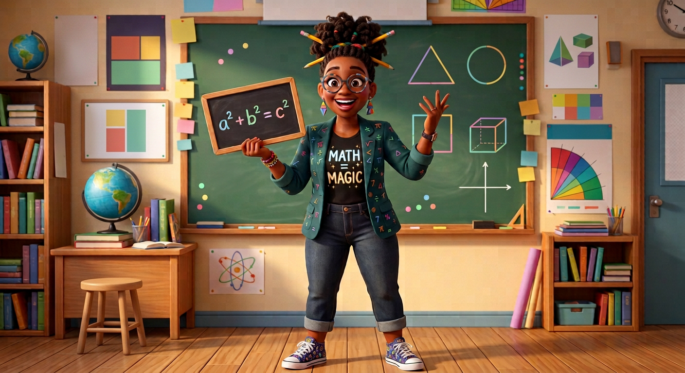

# Ms. Pythagoras — Visual Library

> **Status:** Approved identity; equations and anatomy corrected August 18, 2026

## Approved art

**[hero-ms-pythagoras.png](02-approved/hero-ms-pythagoras.png)** — controlling visual identity

## Signature locks

- Quirky joyful Black math teacher in her 30s
- High textured bun with colorful bands/pencils; geometric glasses and triangle earrings
- Math-symbol teal blazer, black `MATH = MAGIC` shirt, cuffed jeans, math-pattern sneakers
- Held theorem `a² + b² = c²` is correct; background uses unlabeled geometry only

## Reference sheets

_New turnaround, expression row, wardrobe/prop palette, and recurring poses will be built from the approved hero._

## Superseded—do not use as current reference

- [ms-pythagoras-incorrect-equations-original.png](99-superseded/ms-pythagoras-incorrect-equations-original.png)
- [ms-pythagoras-text-cleanup-intermediate-v02.png](99-superseded/ms-pythagoras-text-cleanup-intermediate-v02.png)

## Approval rule

The approved hero supplies Ms. Pythagoras’s exact identity. If a future image drifts or reintroduces technical errors, reject the image—not the character.
