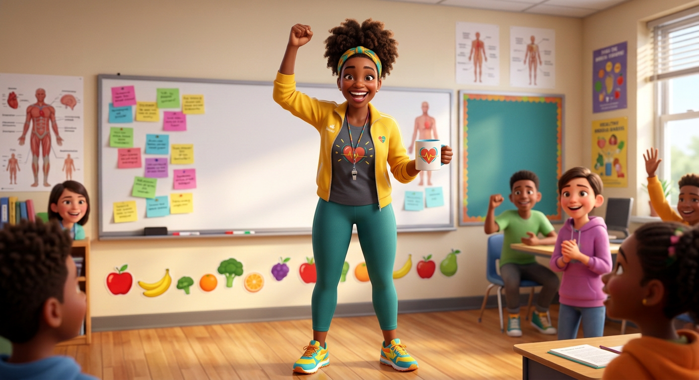

# Ms. Vitality — Visual Library

> **Status:** Approved identity; clean full-body hero produced August 18, 2026

## Approved art

**[hero-ms-vitality.png](02-approved/hero-ms-vitality.png)** — controlling visual identity

## Signature locks

- Energetic joyful Black health teacher in her 30s
- High natural puff and teal-gold headband
- Sunny-yellow athletic jacket, charcoal heart-icon tee, teal leggings, bright sneakers
- Whistle/lanyard, raised fist, heart-icon mug; no readable health claims in art

## Reference sheets

_New turnaround, expression row, wardrobe/prop palette, and recurring poses will be built from the approved hero._

## Superseded—do not use as current reference

- [ms-vitality-text-artifacts-original.png](99-superseded/ms-vitality-text-artifacts-original.png)

## Approval rule

The approved hero supplies Ms. Vitality’s exact identity. If a future image drifts or reintroduces technical errors, reject the image—not the character.
