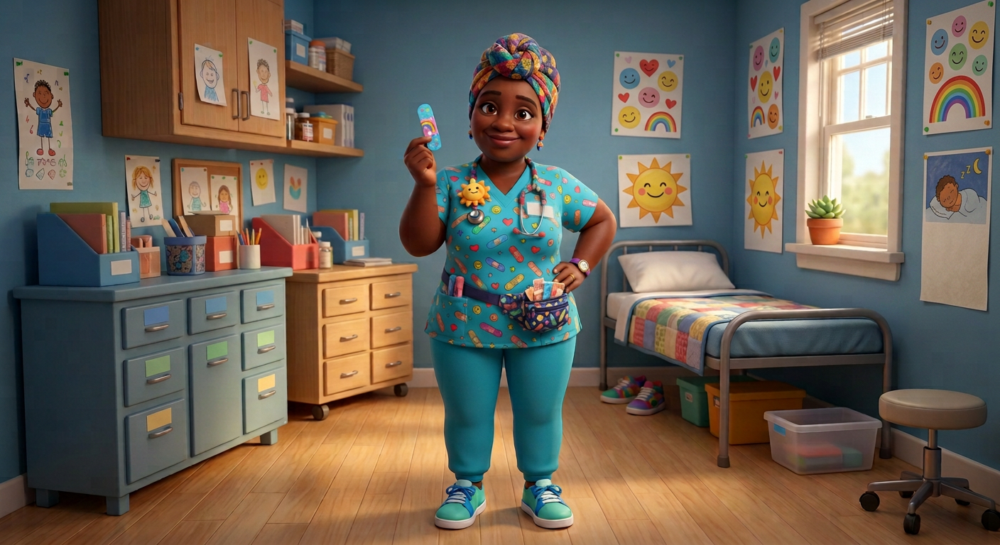

# Nurse Nightingale — Visual Library

> **Status:** Approved identity; clean text-free full-body hero produced August 18, 2026

## Approved art

**[hero-nurse-nightingale.png](02-approved/hero-nurse-nightingale.png)** — controlling visual identity

## Signature locks

- Warm quirky Black school nurse in her 40s
- Colorful woven headwrap, earrings, warm knowing eyes
- Turquoise icon-pattern scrubs, plush-sun stethoscope charm, fanny pack, teal-white nursing sneakers
- Rainbow bandage held like a prize; office contains no readable labels

## Reference sheets

_New turnaround, expression row, wardrobe/prop palette, and recurring poses will be built from the approved hero._

## Superseded—do not use as current reference

- [nurse-nightingale-cropped-original.png](99-superseded/nurse-nightingale-cropped-original.png)
- [nurse-nightingale-labeled-intermediate-v02.png](99-superseded/nurse-nightingale-labeled-intermediate-v02.png)

## Approval rule

The approved hero supplies Nurse Nightingale’s exact identity. If a future image drifts or reintroduces technical errors, reject the image—not the character.
