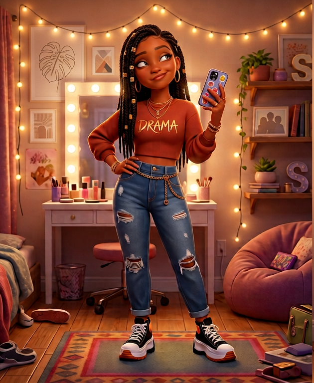

# Seraphina Washington — Visual Library

> **Status:** Uploaded identity/outfit approved August 18, 2026; clean original bedroom hero produced; full reference sheet pending

## Approved art

**[hero-seraphina.png](02-approved/hero-seraphina.png)** — controlling visual identity and hero outfit

## Signature locks

- 15-year-old dramatic oldest sister with deep warm-brown skin
- Long center-parted braids with gold cuffs, winged eyeliner, gold hoops, layered jewelry
- Rust cropped `DRAMA` sweatshirt, distressed cuffed jeans, gold chain belt
- Black-and-white chunky platform high-tops and smartphone
- Affectionate eye-roll and knowing smirk
- Original bedroom decor only; no copyrighted band posters or brand logos

## Reference sheets

_New turnaround, expression row, outfit palette, phone, jewelry, and bedroom callouts will be built from the approved hero._

## Superseded—do not use as current reference

- [Previous Arena hero](99-superseded/hero-seraphina-arena-previous.png)
- [Uploaded bedroom image with branded poster](99-superseded/hero-seraphina-chatgpt-branded-bedroom-v01.png)
- [Wide cleanup intermediate](99-superseded/seraphina-clean-wide-intermediate-v02.png)
- [Early Seraphina candidate](99-superseded/seraphina-early-candidate.png)

## Approval rule

The approved hero supplies Seraphina's exact face, age-read, hair, makeup, proportions, and signature outfit. If a future image drifts, reject the image—not Seraphina.
