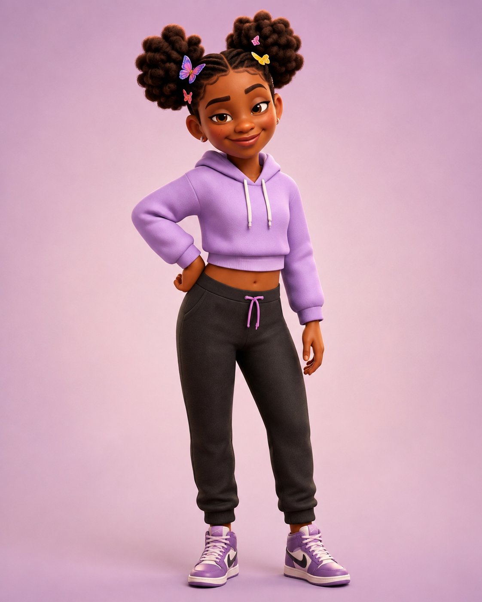
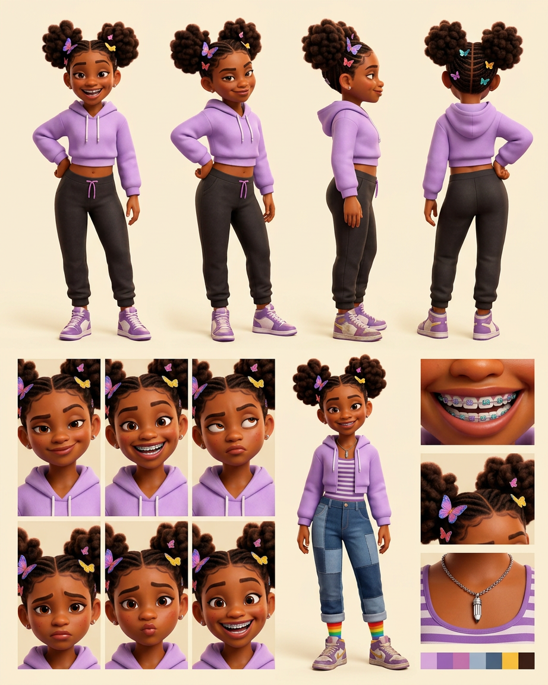

# Solani Maya Washington — Visual Library

> **Status:** Uploaded ChatGPT hero approved August 18, 2026; full reference sheet pending

## Upload new candidates

Drop original, highest-resolution images into **`00-upload-candidates/`** on GitHub. Images from ChatGPT or another generator may be used as candidates when Keisha generated them or otherwise has the right to use them. Avoid third-party character art that is not ours.

Recommended filename: `source-YYYY-MM-DD-short-description.png`

After uploading, tell the Workhorse which character you updated. No upload becomes the approved face automatically; Keisha chooses the winner at a focused visual gate.

## Approved art

**[hero-solani.png](02-approved/hero-solani.png)** — controlling visual identity and hero outfit

## Story and outfit locks

- Her open smile retains the canonical gap tooth and deep dimples.
- Uncle Mo's silver pencil-charm necklace remains a recurring story prop even though this hero portrait does not show it.
- Approved alternate outfit: lavender cropped hoodie over a striped tank, baggy patchwork jeans, mismatched rainbow socks, and dusty sneakers.

## Candidates

_None currently awaiting review._

## Approved reference board

**[Braces-aware model board v02](03-reference-sheets/approved-solani-braces-model-board-v02.png)**

This board locks turnaround views, braces/elastics, gap/dimples, expression range, hero and alternate outfits, butterfly clips, pencil necklace, and palette.

## Scenes

_New scenes must use the approved hero and future reference sheet._

## Superseded—do not use as current reference

- [Previous Arena hero with incorrect storefront](99-superseded/hero-solani-arena-wrong-storefront.png)
- [Early Solani candidate](99-superseded/solani-early-candidate.png)
- [No-braces model-board attempt](99-superseded/solani-model-board-no-braces-v01.png)

## Approval rule

The approved hero supplies Solani's exact face, hair, age-read, proportions, and hero outfit. Her story locks and approved alternate outfit are preserved in text and must appear in the future reference sheet. If a future image drifts, reject the image—not Solani.
