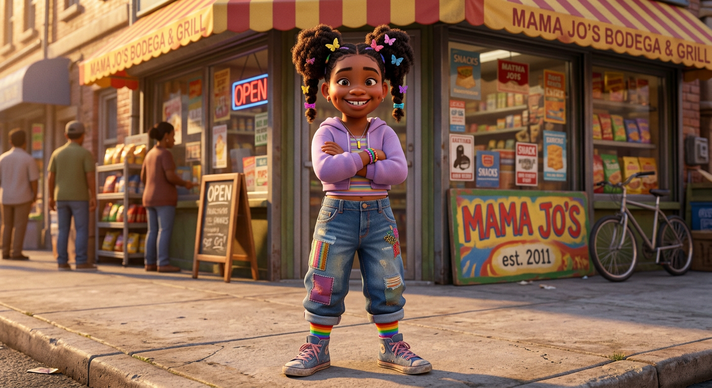
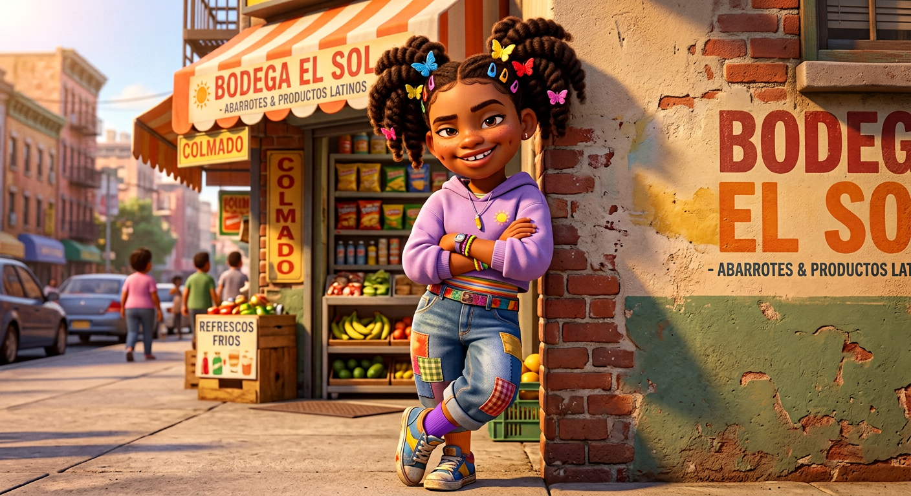

# Solani Maya Washington — Visual Library

> **Status:** Character design approved; hero background correction pending

## Upload new candidates

Drop original, highest-resolution images into **`00-upload-candidates/`** on GitHub. Images from ChatGPT or another generator may be used as candidates when Keisha generated them or otherwise has the right to use them. Avoid third-party character art that is not ours.

Recommended filename: `source-YYYY-MM-DD-short-description.png`

After uploading, tell the Workhorse which character you updated. No upload becomes the approved face automatically; Keisha chooses the winner at a focused visual gate.

## Newly uploaded candidates

**[chatgpt-2026-08-18-hero-solani-maya-washington-v01.png](00-upload-candidates/chatgpt-2026-08-18-hero-solani-maya-washington-v01.png)**

## Approved art

_None yet._

## Candidates

**[hero-solani-character-approved-bg-fix-needed.png](01-candidates/hero-solani-character-approved-bg-fix-needed.png)**

**[solani.png](01-candidates/solani.png)**

## Reference sheets

_None yet._

## Scenes

_None yet._

## Approval rule

The approved hero supplies the face and identity. The later reference sheet locks turnaround, expressions, outfit/hair palette, proportions, and recurring props. If a future image drifts, reject the image—not the character.
