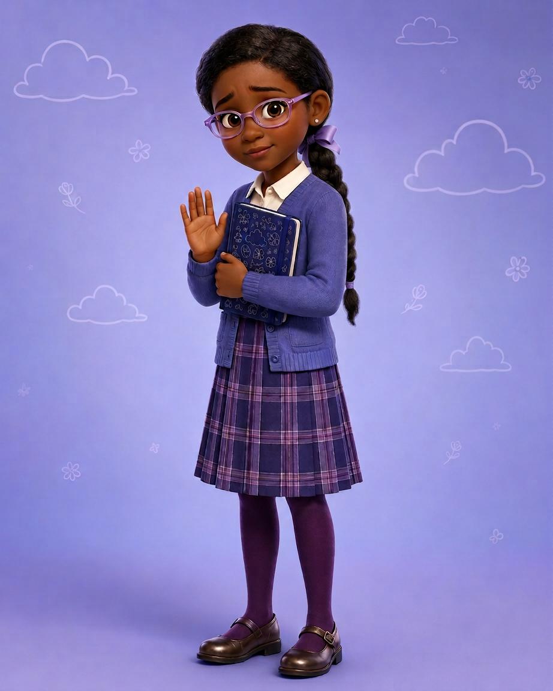
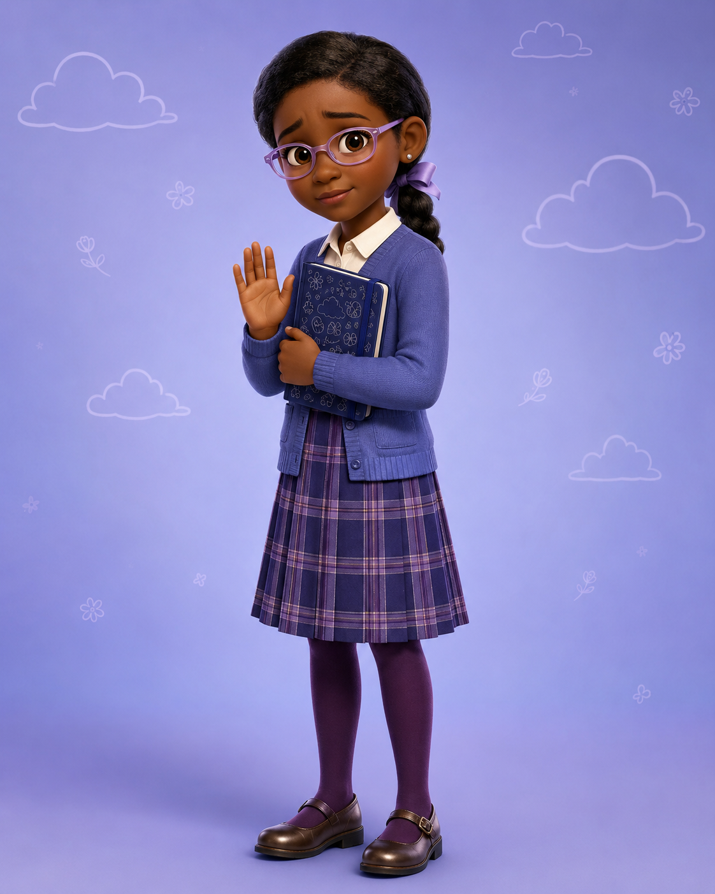

# Sophie — Visual Library

> **Status:** Identity/design selected by Keisha; premium cast-match rendering awaiting final approval

## Cast-match candidate

**[arena-2026-08-18-hero-sophie-cast-match-v04.png](00-upload-candidates/arena-2026-08-18-hero-sophie-cast-match-v04.png)**

## Chosen source identity

**[chatgpt-2026-08-18-hero-sophie-v03.png](00-upload-candidates/chatgpt-2026-08-18-hero-sophie-v03.png)**

## Identity/design retained

- Smooth side-parted natural hair into one long low braid with lavender ribbon
- Angular translucent lavender glasses and silver studs
- Ivory collared blouse, periwinkle cardigan, navy-lavender plaid pleated skirt
- Deep-plum tights, polished brown Mary Janes
- Closed navy doodle notebook and hesitant raised palm
- Reserved, kind, conflicted 10-year-old expression

## Superseded—do not use as current reference

- [First preppy redesign](99-superseded/sophie-preppy-first-redesign-v02.png)
- [Previous similar Emma/Sophie design](99-superseded/sophie-previous-similar-design.png)

## Approval rule

The v04 image remains a candidate until Keisha confirms that its premium 3D rendering matches the cast. If approved, v03 remains provenance/reference and v04 becomes the controlling hero.
