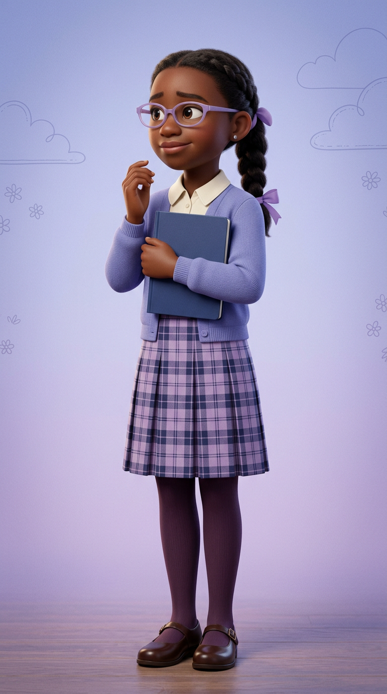

# Sophie — Visual Library

> **Status:** Previous similar design rejected; preppy sidekick redesign awaiting approval

## Current redesign candidate

**[arena-2026-08-18-hero-sophie-redesign-v02.png](00-upload-candidates/arena-2026-08-18-hero-sophie-redesign-v02.png)**

## Proposed distinction

- One sleek low braided ponytail with lavender ribbons
- Narrow translucent lavender oval glasses
- Ivory collar, periwinkle cardigan, lavender/navy plaid skirt
- Plum tights, polished brown Mary Janes, closed navy notebook
- Controlled preppy palette and hesitant half-raised hand

## Superseded—do not use as current reference

- [Previous similar design](99-superseded/sophie-previous-similar-design.png)

## Approval rule

Sophie remains a candidate until Keisha explicitly approves this redesign. The superseded bun/cardigan version cannot seed new assets.
