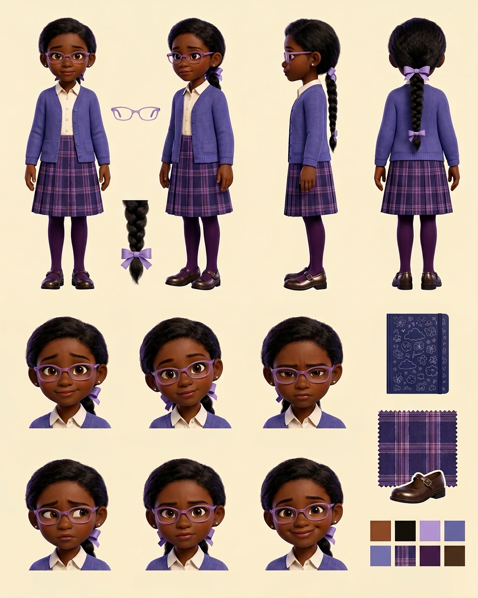

# Sophie — Visual Library

> **Status:** Premium 3D v04 hero approved August 18, 2026; full reference sheet pending

## Approved art

**[hero-sophie.png](02-approved/hero-sophie.png)** — controlling visual identity

## Signature locks

- 10-year-old Black girl with deep rich-brown skin and soft heart-shaped face
- One long smooth side-parted low braid tied with lavender ribbon
- Angular translucent lavender glasses and silver studs
- Ivory collar, periwinkle cardigan, long lavender/navy plaid pleated skirt
- Deep-plum tights and polished brown Mary Janes
- Closed navy doodle notebook held protectively; hesitant raised palm
- Premium dimensional 3D rendering aligned with the approved cast

## Reference sheets

_New turnaround, expression row, braid/ribbon/glasses callouts, wardrobe palette, notebook details, and hesitant/confident progression poses will be built from the approved hero._

## Approved reference board

**[approved-sophie-model-board-v02.png](03-reference-sheets/approved-sophie-model-board-v02.png)**

This clean board locks four views, six expressions, isolated props, and palette without callout arrows or captions.

## Superseded—do not use as current reference

- [Chosen source identity v03](99-superseded/sophie-chosen-source-v03.png)
- [First preppy redesign v02](99-superseded/sophie-preppy-first-redesign-v02.png)
- [Previous similar Emma/Sophie design](99-superseded/sophie-previous-similar-design.png)

## Approval rule

The approved v04 hero supplies Sophie's exact face, age-read, hair, glasses, proportions, pose, wardrobe, and rendering level. If a future image drifts, reject the image—not Sophie.
