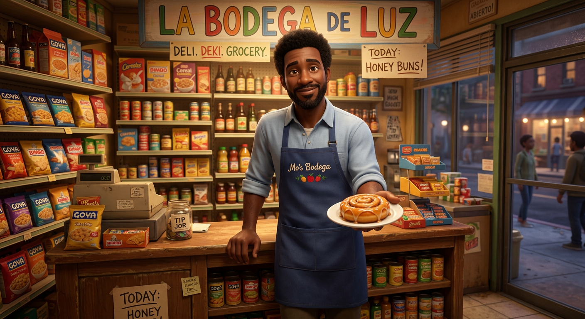

# Uncle Mo — Visual Library

> **Status:** Hero approved

## Upload new candidates

Drop original, highest-resolution images into **`00-upload-candidates/`** on GitHub. Images from ChatGPT or another generator may be used as candidates when Keisha generated them or otherwise has the right to use them. Avoid third-party character art that is not ours.

Recommended filename: `source-YYYY-MM-DD-short-description.png`

After uploading, tell the Workhorse which character you updated. No upload becomes the approved face automatically; Keisha chooses the winner at a focused visual gate.

## Approved art

**[hero-uncle-mo.png](02-approved/hero-uncle-mo.png)**

## Candidates

_None yet._

## Reference sheets

_None yet._

## Scenes

_None yet._

## Superseded—do not use as current reference

- [tio-mo-retired-canon.png](99-superseded/tio-mo-retired-canon.png)

## Approval rule

The approved hero supplies the face and identity. The later reference sheet locks turnaround, expressions, outfit/hair palette, proportions, and recurring props. If a future image drifts, reject the image—not the character.
